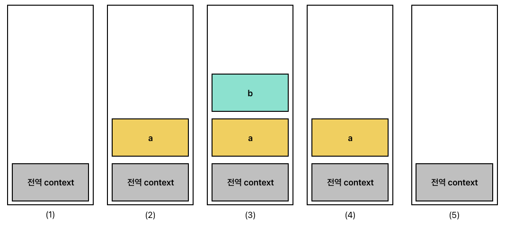

>자바스크립트가 동작할 때 나타나는 실행 컨텍스트를 정리해본다

## 실행 컨텍스트(Execution Context)
실행할 코드에 제공할 환경 정보들을 모아놓은 객체

 자바스크립트의 동적 언어로서의 성격을 가장 잘 파악할 수 있는
개념으로 자바스크립트는 동일한 환경에 있는 환경 정보들을 모은 실행 컨텍스트를 콜스택에 쌓은 후 실행해 코드의 환경과 순서를 보장한다.

### 실행 컨텍스트 구성
실행 컨텍스트는 아래 조건중 하나를 충족하면 콜스택에 쌓이게 된다.
* 전역공간은 자동으로 컨텍스트로 구성
* 함수 실행 시
* eval() 실행 시

일반적으로는 함수를 이용한 실행 컨텍스트를 사용한다.

다음과 같은 코드가 주어졌을 경우
```javascript
var str = 'str'; //전역 컨텍스트

function a () { // a 컨텍스트
	function b () { // b 컨텍스트
		console.log(str); // undefined
		str='str2';
		console.log(str); //str2
	}
	a();
	console.log(str) //str
}	
b();
console.log(str) // str
```
실행 컨텍스트의 스택은 다음과 같은 순서로 실행된다.
<p align='center'>

</p>
자바스크립트 코드가 실행되면,
1. (1)-전역 컨텍스트가 생성되어 콜스택에 쌓이고, 실행된다.
2. (2)-a 함수가 호출되면 컨텍스트가 생성되며, 콜스택에 쌓이고, 실행된다.
3. (3)-a 함수 안에 b 함수가 호출되면 a 함수의 실행이 멈추고 컨텍스트가 생성되며 콜스택에 쌓이고, 실행된다.
4. (4)-b 컨텍스트의 실행이 완료되면 콜스택에서 삭제되고, a 컨텍스트를 중단 시점부터 실행한다.
5. (5)-a 컨텍스트의 실행이 완료되면 콜스택에서 삭제되고, 전역 컨텍스트를 중단 시점부터 실행 후 실행을 완료한다.

이런 방식으로 동작하는 실행 컨텍스트는 다음과 같은 구성요소를 가지고 있다.
* VariableEnvironment
	* 현재 컨텍스트 내의 식별자들에 대한 정보
	
	* 외부 환경 정보
	
	위와 같은 정보들을 담고 있으며, 최초 실행시의 스냅샷을 유지한다. <br>
	실행 컨텍스트를 생성할 때 VariableEnvironment에 정보를 먼저 담은 후 복사해 LexicalEnvironment를 생성하며, <br>
	VariableEnvironment는 스냅샷 유지 목적으로 사용된다.
* LexicalEnvironment
	* environmentRecord : 현재 컨텍스트의 식별자들을 수집한다.

		코드 실행 전 식별자들을 수집하는 과정을 추상화해 호이스팅이라는 개념이 만들어졌다.<br>
	* outerEnvironmentReference : 상위 컨텍스트의 LexicalEnvironment를 가리킨다.

		이를 통해 상위 컨텍스트의 데이터들을 참조할 수 있게 된다.
* ThisBinding
	* 식별자가 바라봐야 할 대상 객체
___
### Block Level Scope와 VariableEnvironment, LexicalEnvironment
>우선적으로 다음의 내용은 공식 문서나 공식 스펙에 명시되어 있는 내용은 아니며, 이렇게 해석하는 내용이 다수일 뿐임을 밝힌다.
또한 공식 스펙은 실행 컨텍스트 개념이 순전히 매커니즘에 불과하며, ECMAScript 구현의 특정 아티팩트에 해당할 필요가 없음을 명시하고 있다.

* es6로 넘어오면서 const, let이 추가되고 block level scope 개념이 자바스크립트에 도입되었다.
알다시피 const, let은 var와 달리 호이스팅 시에 초기화가 진행되지 않으며, block level scope를 따른다.

* block scope는 외부에서 block 내부로의 접근을 허용하지 않는다. 이는 외부에서는 block 내부를 찾을 수 없다는 것을 의미한다.
실행 컨텍스트의 생성 조건에는 block이 존재하지 않기 때문에 자바스크립트 엔진은 실행 컨텍스트를 추가해 block을 따로 실행시키지 않는다. 

* 다음과 같은 상황에서 자바스크립트 엔진은 현재 실행 컨텍스트에 block을 위한 임시 LexicalEnvironment를 생성한다.
이후 실행 컨텍스트는 임시 LexicalEnvironment를 바라보고 임시 LexicalEnvironment는 let, const 변수들을 관리한다.

* 해당 block이 종료되면, block 이전 스냅샷을 유지하고 있던 VariableEnvironment를 통해 원래 LexicalEnvironment가 가지고 있던 변수들을 복구 한다.
* 위의 해석에서는 block scope가 외부 변수를 참조할 수 있는 것을 설명하지 못하는 것(?) 같다. 이 내용은 또 추후에 찾아서 정리해본다
___
**참고 사이트**
>github.io-개발자 황준일
* https://junilhwang.github.io/TIL/Javascript/Domain/Execution-Context/#_2-실행-컨텍스트-구성

>velog-요행을 바라지 않는 개발자-edie_ko-실행 컨텍스트란 무엇인가요?
* https://velog.io/@edie_ko/js-execution-context

>ECMAScript® 2023 Language Specification-9.4 Execution Contexts
* https://tc39.es/ecma262/#sec-execution-contexts