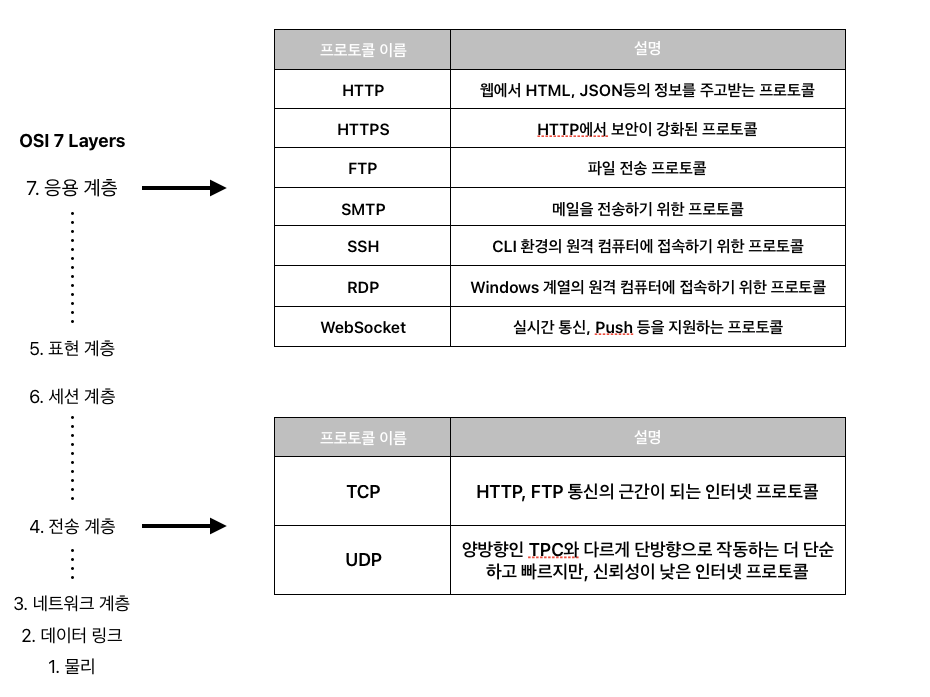
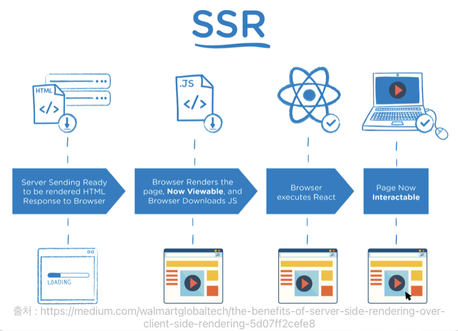
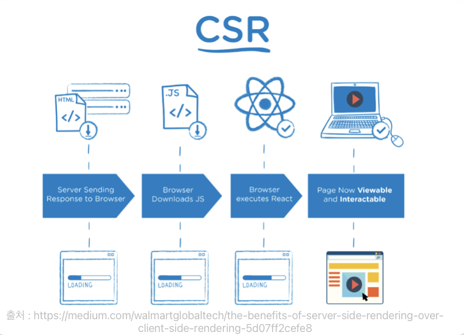

>기초적인 http/network

## 클라이언트-서버 아키텍처(client-sever architecture)
인터넷 연결이 필수적인 앱 등에서 그 구조를 사용자와 상호작용하는 `client`와 앱에 필요한 리소스를 전달해주는 `server` 이 두 가지로 나눠놓은 것을 2-Tier architecture 혹은 클라이언트-서버 아키텍처라고 부른다.

그리고 여기에 더해서 리소스를 따로 저장해놓는 `데이터베이스`를 추가해 3-Tier architecture 라고 부른다.

* client : 플랫폼에 따라 구분되며, 웹 플랫폼에서는 웹사이트 또는 웹앱, 스마트폰/태블릿 플랫폼에서는 앱
* server : 무엇을 하느냐에 따라 종류가 달라진다. 파일 서버는 파일을 제공하는 앱, 웹 서버는 웹사이트에서 필요로하는 정보들을 제공하는 앱, 메일 서버는 메일을 주고받을 수 있도록 도와주는 앱

이 3가지 부분을 프론트앤드, 백앤드 두 영역으로 나눌 수 있다.
* 프론트앤드 : client(브라우저, 앱)
* 백앤드 : server, database

## 클라이언트-서버 통신
웹 앱 아키텍처에서는 클라이언트와 서버가 서로 HTTP라는 프로토콜을 이용해 통신한다. HTTP를 통해 주고받는 메시지를 'HTTP 메시지'라고 한다.

### API
Application Programming interface
서버의 리소스에 접근할 수 있는 접점  
일종의 메뉴판

### HTTP API 디자인
REUD
* Read(조회) : GET 메서드
* Create(추가) : POST
* Update(갱신) : PUT 또는 PATCH
* Delete(삭제) : DELETE

## 브라우저 작동원리 1
### URL, URI
* URL : Uniform Resource Locator, 네트워크 상에서 웹 페이지, 이미지, 동영상 등의 파일이 위치한 정보를 나타낸다.

	scheme, hosts, url-path로 구분된다.

	||명칭|설명|
	|:--:|:--:|:--:|
	|`file://`, `http://`, `https://`|scheme|통신 프로토콜|
	|`127.0.0.1`, `www.google.com`|hosts|웹 페이지, 이미지, 동영상 등의 파일이 위치한 웹 서버, 도메인 또는 ip|
	|`:80`, `:443`, `:3000`|port|웹 서버에 접속하기 위한 통로|
	|`/search`, `/Users/username/Desktop`|url-psth|웹 서버의 루트 디렉토리로부터 웹 페이지, 이미지, 동영상 등의 파일 위치까지의 경로|
	|`q=Javascript`|query|웹 서버에 전달하는 추가 질문|
* URI : Uniform Resource Identifier, 일반적으로 URL의 기본요소인 scheme, hosts, url-path에 더해 query, fragment를 포함

	fragment는 일종의 북마크 기능을 수행하며 URL에 fragment(`#`)와 특정 HTML요소의 id를 전달하면 해당 요소가 있는 곳으로 스크롤을 이동할 수 있다.

### IP와 port
* IP address: 네트워크에 연결된 특정 PC의 주소를 나타내는 체계
  * IPv4 : 전 세계적으로 사용된 첫 번째 프로토콜, 네 덩이의 숫자로 구분되어 있으며, 2^(32)인 약 43억 개의 주소를 가지며, 몇 몇 주소는 용도가 정해져 있다.
	* `localhost`, `127.0.0.1` : 현재 사용 중인 로컬 PC
	* `0.0.0.0`, `255.255.255.255` : broadcast address, 로컬 네트위크에 접속된 모든 장비와 소통하는 주소, 서버에서 접근 가능 ip주소를 broadcast address로 지정하면, 모든 기기에서 서버에 접근 가능
  * IPv6 : IPv4의 수용 한계를 보안하기 위해 나온 버전, 2^(128)의 주소를 가진다.

* port : ip주소가 가리키는 PC에 접속할 수 있는 통로(채널)

	포트번호는 0~65535 까지 존재 0~1024	 까지는 주요 통신을 위한 규약에 따라 정해져 있다.
	* 22 : SSH
	* 80 : HTTP
	* 443 : HTTPS

	잘 알려진 포트의 경우는 생략이 가능하나 임시포트는 반드시 포트번호를 포함해야한다.
### 도메인과 DNS
* 도메인 : 웹 브라우저를 통해 특정 사이트에 진입할 떄 IP주소 대신 사용가능한 주소가 있다. IP주소가 도로명 주소라면, 도메인 이름은 해당 주소 건물의 상호로 볼 수 있다.

	`localhost` 를 제외한 모든 도메인 이름은 일정 기간동안 대여해 사용한다.
* DNS : Domain Name System, 호스트의 도메인 이름을 IP주소로 변환하거나 반대의 경우를 수행할 수 있도록 개발된 데이터베이스 시스템.
## HTTP
### HTTP Messages
HTTP Messages는 클라이언트와 서버 사이에서 데이터가 교환되는 방식 
몇 줄의 텍스트 정보로 구성.(구성 파일, API, 기타 인터페이스에서 HTTP Messages를 자동으로 완성)

구조
1. start line(status line) : 요청이나 응답의 상태를 나타낸다.
2. HTTP headers : 요청을 지정하거나, 메시지에 포함된 본문을 절명하는 헤거의 집합
3. empty line : 헤더와 본문을 구분하는 빈 줄
4. body : 요청과 관련된 데이터나 응답과 관련된 데이터 또는 문서를 포함. 요청과 응답의 유형에 따라 선택적으로 사용
* start line(staus line)과 HTTP headers 를 묶어 요청이나 응답의 헤드(head)라고 하고, payload(사용에 있어서 전송되는 데이터)는 body라고 이야기 한다. 

Stateless : HTTP로 클라이언트와 서버가 통신을 주고받는 과정에서 HTTP는 클라이언트나 서버의 상태를 확인하지 않는다. 클라이언트에서 발생한 사용자 상호작용에 대한 모든 상태를 HTTP통신이 추적하지 않는다. 필요에 따라 쿠키-세션, API 등을 통해 상태를 확인할 수 있다. **HTTP의 가장 큰 특징**

두 가지 유형
* Requests(요청) : 클라리언트가 서버에게 보내는 메시지
  * start line
	1. 수행할 작업(GET, PUT, POST 등)이나 방식(HEAD or OPTIONS)을 설명하는 HTTP method를 나타낸다.
	2. 요청 대상(일반적으로 URL, URI) 또는 프로토콜, 포트, 도메인의 절대 경로는 요청 컨텍스트에 작성된다. 요청 형식은 HTTP method마다 다르다.
	* origin 형식 : `'?'` 와 쿼리 문자열이 붙는 절대 경로. GET, POST, HEAD, OPTIONS 등의 method와 함께 사용 
	`POST / HTTP 1.1` 
	`GET /background.png HTTP/1.0` 
	`HEAD /test.html?query=alibaba HTTP/1.1` 
	`OPTIONS /anypage.html HTTP/1.0`
	* absolute 형식 : 완전한 URL 형식으로, 프록시에 연결하는 경우 대부분 GET method와 함께 사용한다. 
	`GET http://developer.mozilla.org/en-US/docs/Web/HTTP/Messages HTTP/1.1`
	* authority 형식 : 도메인 이름과 포트 번호로 이루어진 URL의 일부분. HTTP 터널을 구축하는 경우, CONNECT와 함께 사용할 수 있다. 
	`CONNECT developer.mozilla.org:80 HTTP/1.1`
	* asterisk 형식 : `OPTIONS` 와 함께 `*`하나로 서버 전체를 표현 
	`OPTIONS * HTTP/1.1` 
	3. HTTP 버전에 따라 message의 구조가 달라진다. 따라서 start line에 HTTP버전을 함께 입력한다.
  
  *	Headers : 요청의 헤더는 기본 구조를 따른다. `Header-Name(대소문자 구분이 없는 문자열): value`
	1. `General headers` : 메시지 전체에 적용되는 헤더, body를 통해 전송되는 데이터와는 관련이 없다.
	2. `Request headers` : fetch를 통해 가져올 리소스나 클라이언트 자체에 대한 자세한 정보를 포함하는 헤더를 의미. User-Agent, Accept-Type, Accept-Language와 같은 헤더는 요청을 보다 구체화한다. Referer처럼 컨텍스트를 제공하거나 If-None과 같이 조건에 따라 제약을 추가할 수 있다.
	3. `Representation headers` : 이전에는 Entity headers로 불렸으며, body에 담긴 리소스의 정보(콘텐츠 길이, MIME 타입 등)를 포함하는 헤더
	

	

  * Body : 요청의 본문은 HTTP Messages 구조의 마지막에 위치하며, GET, HEAD, DELETE, OPTIONS처럼 서버에 리소스를 요청하는 경우에는 필요하지 않다. POST나 PUT과 같은 일부 요청은 데이터를 업데이트하기 위해 body를 사용한다.
	* Single-resource bodies(단일-리소스 본문) : 헤더 두 개(Content-Type과 Content-Length)로 정의된 단일 파일로 구성
	* Multiple-resource bodies(다중-리소스 본문) : 여러 파트로 구성된 본문에서는 각 파트마다 다른 정보를 지니며, 보통 HTML form과 관련이 있다

* Responses(응답) : 서버가 클라이언트에게 보내는 메시지
  * status line ex) `HTTP/1.1 404 Not Found`
	1. 현재 프로토콜의 버전 (HTTP/1.1)
	2. 상태 코드 - 요청의 결과 ex) 200, 302, 404 등
	3. 상태 텍스트 - 상태 코드에 대한 설명
  * Headers : 요청 해더와 동일한 구조를 가진다.
	1. `General headers` : 메시지 전체에 적용되는 헤더, body를 통해 전송되는 데이터와는 관련이 없다.
	2. `Response headers` : 위치 또는 서버 자체에 대한 정보(이름, 버전 등)와 같이 응답에 대한 부가적인 정보를 갖는 헤더. Vary, Accept-Ranges와 같이 상태 줄에 넣기에는 공간이 부족했던 추가 정보를 제공한다.
	3. `Representation headers` : 이전에는 Entity headers로 불렸으며, body에 담긴 리소스의 정보(콘텐츠 길이, MIME 타입 등)를 포함하는 헤더
	
	

	

  
  * Body : HTTP Messages 구조의 마지막에 위치하며, 201, 204와 같은 상태 코드를 가지는 응답에는 필요하지 않다.
	* Single-resource bodies(단일-리소스 본문)
	  1. 길이가 알려진 단일-리소스 본문은 두 개의 헤더(Content-Type, Content-Length)로 정의
	  2. 길이를 모르는 단일 파일로 구성된 단일-리소스 본문은 Transfer-Encoding이 chunked 로 설정되어 있으며, 파일은 chunk로 나뉘어 인코딩되어 있다.
	* Multiple-resource bodies(다중-리소스 본문) : 서로 다른 정보를 담고 있는 body

## 브라우저의 작동 원리 2
### AJAX
Asynchronous JavaScript And XMLHttpRequest의 약자로, JavaScript, DOM, Fetch, XMLHttpRequest, HTML 등의 다양한 기술을 사용하는 웹 개발 기법이다.

가장 큰 특징은, 웹 페이지에 필요한 부분에 필요한 데이터만 비동기적으로 받아와 화면에 그려낼수 있다는 점이다.

* AJAX의 두 가지 핵심기술 : javascript와 DOM, fetch

	전통적인 웹 앱은 `<form>` 태그를 이용해 서버에 요청을 보내고 응답으로 새로운 페이지를 제공받아야 했지만(페이지를 이동해야 했지만),  Fetch를 사용해 페이지를 이동하지 않아도 필요한 데이터를 받아올 수 있게 됐다. 	Fetch는 서버의 응답을 비동기적으로 받아 페이지를 계속 사용할 수 있고, javascript 에서 DOM을 사용해 조작할 수 있기 때문에, Fetch로 필요한 데이터만 가져와 DOM에 적용시켜 새로운 페이지로 이동하지 않고, 기존 페이지에서 필요한 부분만 변경할 수 있다.
* AJAX의 장점

	* 서버에서 HTML을 완성하여 보내주지 않아도 웹페이지를 만들 수 있다.

		이전에는 서버에서 HTML을 완성하여 보내주어야 화면에 렌더링을 할 수 있었지만, AJAX를 사용하면 서버에서 완성된 HTML을 보내주지 않아도 필요한 데이터를 비동기적으로 가져와 브라우저에서 화면의 일부만 업데이트하여 렌더링 할 수 있다.

	* 표준화된 방법

		이전에는 브라우저마다 다른 방식으로 AJAX를 사용했으나, XHR이 표준화되면서부터 브라우저에 상관없이 AJAX를 사용할 수 있게 되었다. 
	* 유저 중심 앱 개발

		AJAX를 사용하면 필요한 일부분만 렌더링하기 때문에 빠르고 더 많은 상호작용이 가능한 앱을 만들 수 있다. 
	* 더 작은 대역폭

		이전에는 서버로부터 완성된 HTML 파일을 받아와야 했기 때문에 한 번에 보내야 하는 데이터의 크기가 컸지만, AJAX에서는 필요한 데이터를 텍스트 형태(JSON, XML 등)로 보내면 되기 때문에 비교적 데이터의 크기가 작다.
* AJAX의 단점
  
	* Search Engine Optimization(SEO)에 불리
		
		처음 받는 HTML파일에는 데이터를 채우기 위한 틀만 작성되어있는 경우가 많아 HTML파일에는 데이터가 없고 뼈대만 있기 때문에 검색엔진에서 주목받기가 힘들다.
	* 뒤로가기 문제
		
		일반적으로 사용자는 뒤로가기 버튼을 누르면 이전 상태로 돌아갈 거라고 생각하지만 AJAX는 이전 상태를 기억하지 않기 때문에 사용자가 의도한 대로 동작하지 않는다. 그래서 뒤로가기 등의 기능 구현을 위해선 History API를 별도로 사용해야 한다.

## SSR과 CSR
* SSR(Server Side Rendering) : 웹 브라우저가 아닌 서버에서 렌더링을 진행하고 렌더링 한 웹 페이지를 브라우저로 전송하는 방법
  1. 사용자의 요청을 받으면 서버는 렌더링 가능한 html파일을 만들고 클라이언트(브라우저)에 전달한다
  2. 그 후 javacsript파일을 다운받고, javascript 프레임워크를 실행해 컴파일한다.

	  1번 이후 사용자는 브라우저에 렌더링된 페이지를 볼 수 있으나, js파일이 컴파일 완료 될 때까지 조작을 할 수는 없다.
	

	

	* SEO가 우선순위인 경우, 일반적으로 SSR을 사용한다.
	
	* 웹 페이지의 첫 화면 렌더링이 빠르게 필요한 경우, 단일 파일 용량이 작은 SSR이 적합하다.
	* 웹 페이지가 사용자와 상호작용이 적은 경우

* CSR(Client Side Rendering) : 클라이언트에서 렌더링을 진행하는 방법
  1. 사용자의 요청을 받으면 서버는 골격이될 html 파일과 js파일을 클라이언트에게 보내고, 클라이언트가 다운을 받는다.
	2. 데이터를 위한 API를 호출하고 서버가 요청에 따라 응답을 보내주면, 렌더링을 완료한다.

		1번 이후 2번이 완료 될때까지 사용자는 로딩화면 혹은 placeholder를 보게된다.
		

		

  * SEO가 우선순위가 아닌 경우
	* 사이트에 풍부한 상호 작용이 있는 경우, CSR은 더 빠른 라우팅으로 강력한 사용자 경험을 제공한다.
	* 웹 앱을 제작하는 경우, CSR을 이용해 더 나은 사용자 경험(빠른 동적 렌더링 등)을 제공할 수 있다. 
* SSR, CSR 차이점

가장 큰 차이는 렌더링의 위치이다. SSR은 서버에서 페이지를 렌더링하고, CSR은 브라우저(클라이언트)에서 페이지를 렌더링한다. CSR은 사용자가 다른 경로를 요청할 떄마다 페이지를 새로고침하지 않고, 동적으로 라우팅을 관리한다.

____
**참고 사이트**
>Medium-Alex Grigoryan-The Benefits of Server Side Rendering Over Client Side Rendering
* https://medium.com/walmartglobaltech/the-benefits-of-server-side-rendering-over-client-side-rendering-5d07ff2cefe8
>MDN-HTTP-HTTP 메시지
* https://developer.mozilla.org/ko/docs/Web/HTTP/Messages