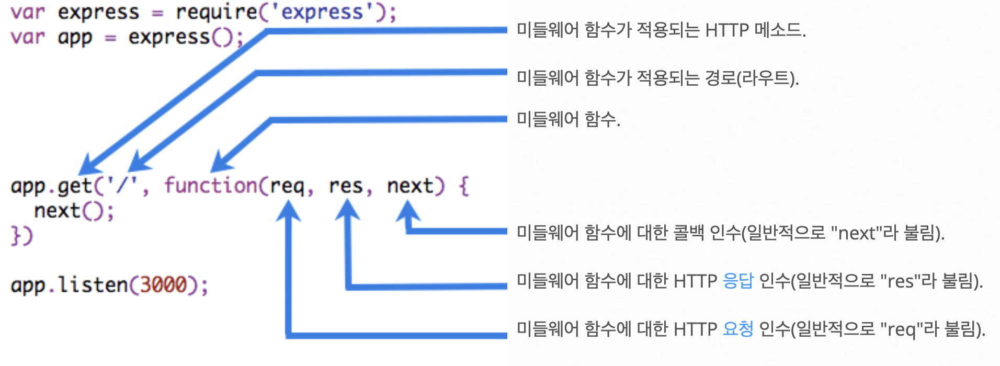

> Node.js 환경에서 사용되는 Express에 대해 간략하게 알아본다.

## Express
Javascrip로 작성되고 Node.js 환경에서 웹 서버, 또는 API 서버를 제작하기 위해 사용되는 인기있는 프레임워크

Express로 서버를 작성하면 Node.js HTTP 모듈로 작성한 서버의 기능 외에 제공되는 `라우터`와 `미들웨어`를 추가 할 수 있다.

### Express 설치
```
npm install express
```
--save 옵션을 통해 설치하면 package.json 파일 내의 dependencies 목록에 추가된다.

### 간단한 웹 서버
```javascript
const express = require('express')
const app = express()
```
파일에 express를 가져오고 사용하기위해서 기본적으로 위의 코드처럼 작성한다.
```javascript
const port = 3000

app.get('/', (req, res) => {
  res.send('Hello World!')
})

app.listen(port, () => {
  console.log(`Example app listening on port ${port}`)
})
```
express에 기본적인 메서드로는 HTTP 메서드에 따라 작동할 `.get, .post, .put, .delete` 와 서버를 오픈하는 `.listen` 이 있다.

위의 코드는 HTTP 요청에 Hello World! 로 응답한다. 

### 라우팅(Routing)
라우팅이란 URI(또는 경로) 및 특정한 HTTP 요청 메소드(GET, POST 등)인 특정 엔드포인트에 대한 클라이언트 요청에 애플리케이션이 응답하는 방법을 결정하는 것을 의미한다.

express를 사용하지 않고 코드를 작성했을 때는 다음과 같은 모습이지만
```javascript
const server = http.createServer((req, res) => {
  if(req.url === '/lower') {
    if (req.method === 'GET') {
      res.end(data)
    } else if (req.method === 'POST') {
      req.on('data', (req, res) => {
        // do something ...
      })
    }
  }
})
```

Express의 라우터 기능을 활용하면 다음과 같이 직관적인 코드로 작성할 수 있다.
```javascript
const router = express.Router()

router.get('/lower', (req, res) => {
  res.send(data);
})

router.post('/lower', (req, res) => {
  // do something
})
```

### 미들웨어(middleware)
미들웨어란 요청과 응답 사이 중간에서 단계별 동작을 수행하는 express의 핵심 기능이다.

미들웨어는 요청 오브젝트(req), 응답 오브젝트 (res), 그리고 애플리케이션의 요청-응답 주기 중 그 다음의 미들웨어 함수(next) 대한 액세스 권한을 갖는 함수이다.

미들웨어 함수는 다음과 같은 태스크를 수행할 수 있다.
* 모든 코드를 실행
* 요청 및 응답 오브젝트에 대한 변경을 실행
* 요청-응답 주기를 종료
* 스택 내의 그 다음 미들웨어를 호출(next)

미들웨어 함수의 구조
<p align='center'></p>

#### 미들웨어의 종류
* 애플리케이션 레벨 미들웨어

	애플리케이션 전반에서 사용된다.<br>(앱 오브젝트의 인스턴스에 바인드)
* 라우터 레벨 미들웨어

	애플리케이션 레벨 미들웨어와 같지만 사용범위가 라우터로 정해진다.<br>
	(express.Router() 인스턴스에 바인드)
* 오류 처리 미들웨어

	다른 미들웨어와 다르게 4개의 매개변수를 가지며, 오류를 처리하기 위해 사용된다.
* 기본 제공 미들웨어

	express에서 기본적으로 제공하는 미들웨어<br>
	ex) express.static, express.json, express.urlencoded
* 써드 파티 미들웨어

	npm으로 설치해 사용하는 미들웨어<br>
	ex) cors

애플리케이션 레벨 및 라우터 레벨 미들웨어는 선택적인 마운트 경로를 통해 로드할 수 있으며, 일련의 미들웨어 함수를 함께 로드할 수도 있고, 이를 통해 하나의 마운트 위치에 미들웨어 시스템의 하위 스택을 작성할 수 있다.
#### 자주 사용되는 상황(?)
미들웨어가 자주 사용하는 상황은 4가지 정도가 있다.
1. POST 요청 등에 포함된 body(payload)를 구조화 할 때(쉽게 얻고자 할 때)
2. 모든 요청/응답에 CORS 헤더를 붙여야 할 때
3. 모든 요청에 대해 url이나 메서드를 확인할 때
4. 모든 헤더에 사용자 인증 정보가 담겨있는지 확인할 때

#### case 1: POST 요청 등에 포함된 body(payload)를 구조화 할 때(쉽게 얻고자 할 때)

Node.js로 HTTP body를 받을 때에는 네트워크 상의 chunk를 합치고, buffer를 문자열로 변환하는 등 다소 복잡한 방식으로 body를 얻을 수 있었지만
```javascript
let body = [];
request.on('data', (chunk) => {
  body.push(chunk);
}).on('end', () => {
  body = Buffer.concat(body).toString();
  // body 변수에는 문자열 형태로 payload가 담겨져 있다.
});
```
내장 미들웨어인 express.json을 사용하면 이 과정을 간단하게 처리할 수 있다.
```javascript
const jsonParser = express.json();

// 생략
app.post('/api/users', jsonParser, function (req, res) {
	const body = req.body;
})
```

#### case 2: 모든 요청/응답에 CORS 헤더를 붙여야 할 때

Node.js HTTP 모듈을 이용한 코드에 CORS 헤더를 붙이려면, 응답 객체의 writeHead 메서드를 이용하여 라우팅마다 헤더를 매번 넣어주어야 한다. 그뿐만 아니라, OPTIONS 메서드에 대한 라우팅도 따로 구현해야 하는 번거로움이 있다.
```javascript
const defaultCorsHeader = {
  'Access-Control-Allow-Origin': '*',
  'Access-Control-Allow-Methods': 'GET, POST, PUT, DELETE, OPTIONS',
  'Access-Control-Allow-Headers': 'Content-Type, Accept',
  'Access-Control-Max-Age': 10
};

// 생략
if (req.method === 'OPTIONS') {
  res.writeHead(200, defaultCorsHeader);
  res.end()
}
```
써드파티 미들웨어인 cors를 사용하면 간단하게 처리할 수 있다.

npm으로 cors 설치
```bash
npm install cors
```
```javascript
const cors = require('cors');
// 생략
app.use(cors()); // 모든 요청에 CORS 허용

// 특정 요청에 대해 CORS 허용
app.get('/products/:id', cors(), function (req, res, next) {
  res.json({msg: 'This is CORS-enabled for a Single Route'})
})
```

#### case 3: 모든 요청에 대해 url이나 메서드를 확인할 때
만약 특정 endpoint가 아니라 모든 요청에 동일한 미들웨어를 적용하고자 한다면 app.use를 사용하면 된다.
<p align='center'></p>

위와 같은 결과를 출력하려면 다음같이 작성할 수 있다.
```javascript
app.use((req, res, next) => {
   console.log(`http request method is ${req.method}, url is ${req.url}`)
   res.end();
})
app.listen(3000);
```

#### case 4: 요청 헤더에 사용자 인증 정보가 담겨있는지 확인할 때
토큰(Token): 주로 사용자 인증에 사용한다.
```javascript
app.use((req, res, next) => {
  // 토큰이 있는지 확인
  if(req.headers.token){
    req.isLoggedIn = true;
    next();
  } else {
		// 없으면 에러를 응답한다.
    res.status(400).send('invalid user')
  }
})
```

### res.json() vs res.send() and res.end()
미들웨어에서 마지막에 오는 json, send는 각자 인자로 받는 데이터를 내보내는 비슷한 역할을 하는 듯 보이지만 조금 다른 작동방식을 갖는다.

* res.send()

	기본적으로 서버에서 response 처리를 할 때 Content-Type을 지정해 줘야 한다.

	send()는 어떤 데이터 타입을 보내는지에 따라 알맞는 Content-Type을 지정해준다.

* res.json()

	json()은 받은 데이터를 JSON.stringify()를 사용해 JSON 문자열로 변환해 내보낸다.

* res.end()

	end()는 응답 프로세스를 종료하며, http.ServerResponse의 response.end()메서드에서 가져온다.<br>
	데이터 없이 빠르게 응답을 종료할 때 사용한다.

### 라우터 미들웨어 사용예시
라우터 레벨 미들웨어는 래들리케이션 레벨 미들웨어와 혼합해 사용할 수 있다.

애플리케이션 레벨 미들웨어
```javascript
const express = require('express');
const cors = require('cors');
const app = express();
const port = 3000;

const useRouter = require('./router/Router');

app.use(cors());
app.use(express.json());

app.use('/username', useRouter);

app.listen(port, () => {
  console.log(`[RUN] Server... | http://localhost:${port}`);
});
```

라우터 레벨 미들웨어
```javascript
const express = require('express');
const router = express.Router();

router.get('/', (req, res) => {
  // 생략
  return res.status(200).json(data)
});

router.get('/:uuid', (req, res) => {
	// 생략
	return res.status(200).json(data)
});

module.exports = router;
```

___
**참고 사이트**
>코드스테이츠

>Express
* https://expressjs.com/ko/

>MDN-Web 개발 학습하기-Express/Node 소개 
* https://developer.mozilla.org/ko/docs/Learn/Server-side/Express_Nodejs/Introduction

>yohanpro.com-Yohan Kim-Express res.send() vs res.json() vs res.end() 비교
* https://yohanpro.com/posts/nodejs/express-response

>tistory-나를 기록하기-야옹아옹-[express] 미들웨어 뽀개기
* https://12ahn22.tistory.com/entry/express-%EB%AF%B8%EB%93%A4%EC%9B%A8%EC%96%B4-%EB%BD%80%EA%B0%9C%EA%B8%B0